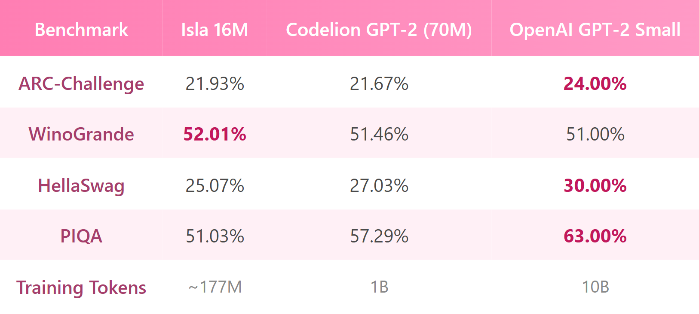

<p align="center">
  
</p>

# Isla-SNN

A lightweight spiking neural network framework for language modeling.

Isla explores a different path for neural attention: instead of dot-product similarity, it measures **spike timing synchrony** - how closely neurons fire together. This gives the model a biologically-inspired inductive bias while keeping everything trainable with standard backpropagation via surrogate gradients.

## Highlights

- **Spike synchrony attention** — a novel RBF-kernel attention based on spike timing similarity
- **LIF neurons** — Leaky Integrate-and-Fire with learnable per-unit decay and vectorised multi-step
- **Rotary Position Embeddings** — RoPE applied before timing mapping for clean positional encoding
- **Simple API** — `isla.train()`, `isla.generate()`, `isla.load_model()`
- **Fast inference** — KV cache + streaming generation
- **Token packing** — zero-waste concatenate-and-chunk for efficient pre-training

## Quick Start

### Train

```python
import isla

model_config = isla.ModelConfig(
    hidden_dim=256,
    num_layers=4,
    num_timesteps=4,
    max_seq_len=1024,
    target_spike_rate=0.3,
)

train_config = isla.TrainConfig(
    lr=3e-4,
    batch_size=16,
    gradient_accumulation_steps=4,
    max_steps=60_000,
    bf16=True,
    gradient_checkpointing=True,
)

data_config = isla.DataConfig(
    dataset_path="./data/corpus.jsonl",
    tokenizer_name="codelion/gpt-2-70m",
    pack_sequences=True,  # concatenate+chunk, no padding waste
)

model, tokenizer = isla.train(model_config, train_config, data_config)
```

### Generate

```python
model, tokenizer = isla.load_model("./outputs/checkpoints/final", device="cuda")

# full generation
print(isla.generate(model, tokenizer, "Once upon a time"))

# streaming (token by token)
print("Hello", end="")
for piece in isla.generate_stream(model, tokenizer, "Hello"):
    print(piece, end="", flush=True)
```

### Benchmark

Evaluate the model on standard NLP benchmarks using the `lm-evaluation-harness` wrapper. We provide a `run_benchmark.py` script that adapts Isla-SNN to evaluate standard datasets smoothly.

```bash
# Run benchmarks (e.g. PiQA, Winogrande, HellaSwag, ARC)
python run_benchmark.py
```

**Results (16M parameters, ~177M tokens):**

<p align="center">
  
</p>

*(Note: As expected for an extremely low-parameter and low-token early run, these metrics represent the statistical chance baseline).*

> **Dataset Citation**: 
> The Isla-SNN models detailed here are pre-trained on [Codelion's GPT-2 70M optimal dataset mixing techniques](https://huggingface.co/blog/codelion/optimal-dataset-mixing). Huge thanks to their research on dataset optimizations, which enables our Spiking architecture to converge effectively on smaller computational constraints.

### Example Output

Despite not having learned advanced logic, the early models successfully collapse into coherent grammatical syntax using biological Spikes. Example generation for a 16M model:

> **Prompt:** How much is 1+1?
> 
> **Isla-SNN:** *The only thing is not a way for all I don't know how it does you do, but I'm just say that I'm in my mind. And I would be good about the answer to me to me and I know to give me*

### CLI

```bash
python main.py --data ./data/corpus.jsonl --gradient-checkpointing --max-steps 60000
```

### Install

```bash
pip install -e .            # core only
pip install -e ".[dev]"     # with pytest, wandb, matplotlib
```

## Project Structure

```
Isla-SNN/
├── isla/                          # framework package
│   ├── __init__.py                # public API with type hints
│   ├── config.py                  # all config dataclasses (with validation)
│   ├── model/
│   │   ├── neurons.py             # LIF neuron + surrogate gradient + multi_step
│   │   ├── attention.py           # spike sync attention + RoPE + KV cache
│   │   └── architecture.py        # IslaModel, SpikingBlock (on-the-fly mask)
│   ├── data/
│   │   └── loader.py              # HF datasets + tokenizer + packing + caching
│   ├── training/
│   │   └── trainer.py             # training loop + best model + W&B + diagnostics
│   └── inference/
│       ├── generate.py            # generate + stream with KV cache
│       └── speed.py               # torch.compile + CUDA tuning
├── main.py                        # CLI entry point
├── pyproject.toml                 # packaging (pip install -e .)
├── configs/
│   ├── small.json                 # ~16M params
│   ├── medium.json                # ~54M params
│   └── ablation_standard_attn.json
├── notebooks/
│   ├── 00_dataset_caching.ipynb   # pre-tokenize datasets
│   ├── 01_train.ipynb             # Colab training
│   └── 02_inference.ipynb         # inference + spike analysis
└── tests/
    ├── test_model.py
    └── verify_all.py              # full verification suite
```

## How It Works

**Spike synchrony attention** replaces the standard dot-product with an RBF kernel on sigmoid-mapped projections:

```
Standard:   score(i,j) = Q_i · K_j / √d
Isla:       score(i,j) = -‖σ(Q_i) - σ(K_j)‖² / τ
```

The sigmoid `σ` maps projections to a `[0,1]` timing space. Tokens with *similar* timing profiles attend to each other, regardless of magnitude. `τ` is a learnable temperature (clamped to `[0.1, 10]` for stability).

**Rotary Position Embeddings (RoPE)** are applied to Q and K *before* the sigmoid mapping, so positional information modulates which timing region each token falls into while preserving the RBF structure.

**LIF neurons** replace GELU/ReLU in the feed-forward blocks:

```
V[t] = β · V[t-1] + I[t]         # leaky integration
S[t] = Θ(V[t] - θ)               # spike if above threshold
V[t] = V[t] · (1 - S[t])         # reset after spike
```

Each neuron has a learnable decay `β ∈ (0,1)`. The output is the mean spike rate across `T` timesteps, giving a smooth signal back to the residual stream. The `multi_step()` method computes T timesteps efficiently and returns per-unit spike rates for fine-grained diagnostics.

**Token packing** concatenates all tokenized texts and re-chunks them into fixed-length blocks. This eliminates padding waste, typically yielding 2-5× more effective training tokens per batch compared to padding-based approaches.

## Training Features

| Feature | Detail |
|---|---|
| Precision | bf16 / fp16 via `torch.cuda.amp` (mutually exclusive, validated) |
| VRAM | Gradient checkpointing (trade compute for memory) |
| Optimizer | AdamW with warmup + cosine decay |
| Training | Epoch-based (auto-computes steps) or step-based, with progress bar |
| Data | Token packing (zero-waste) or padding (fallback) |
| Fine-Tuning | Native instruction prompt-masking (`-100` label suppression via `response_template`) |
| Positions | Rotary Position Embeddings (RoPE) |
| Logging | JSONL + W&B (optional), single-line progress bar |
| Diagnostics | τ, β per layer, spike rates ± std, dead/saturated neuron %, grad norm |
| Checkpoints | Periodic (`step_N/`), best model (`best/`), latest (`latest/`), final (`final/`) |
| Resume | Full state restore: optimizer, scaler, step, tokens_seen, best_val_loss |
| Interrupt-safe | `latest/` always saved on exit (Ctrl+C, Colab disconnect, crash) |
| Speed | torch.compile, cudnn.benchmark, matmul precision |
| Ablation | Swap to standard dot-product attention via config flag |
| Packaging | `pip install -e .` via pyproject.toml |

## Known Limitations

| Limitation | Detail |
|---|---|
| **O(L²) attention** | Spike sync attention uses custom RBF kernel — not compatible with FlashAttention or xformers. Sequence lengths above 2048 will be slow. |
| **Sequential LIF timesteps** | Each spiking MLP runs T timesteps sequentially (T=4 by default), making FFN blocks ~4× slower than standard GELU/SiLU. |
| **Scale** | Tested up to ~16M params. Behavior at 100M+ is unknown — spike dynamics may need retuning (threshold, β init, surrogate slope). |
| **Single GPU** | No distributed training (DDP/FSDP) support yet. |

## Requirements

```text
torch>=2.0.0
transformers>=4.30.0
datasets>=2.14.0
tokenizers>=0.13.0
```

**For Analytics & Evaluation:**
```bash
pip install -q pandas matplotlib wandb
pip install git+https://github.com/EleutherAI/lm-evaluation-harness.git
```

## To-Do

- [ ] **Scale Up**: Train medium config (model >= ~50M parameters) on 1B tokens.
- [ ] **Data Pipeline**: Refine blending distributions for optimal logic acquisition.
- [ ] **Performance**: Profile and write custom CUDA/Triton kernels for the Spiking MLP and RBF Attention (O(L²)) to drop sequence limits.
- [ ] **Hardware Support**: Introduce multi-GPU distributed training (DDP / FSDP).

## References

- Neftci, E. O., Mostafa, H., & Zenke, F. (2019). **Surrogate Gradient Learning in Spiking Neural Networks**: Bringing the Power of Gradient-Based Optimization to Spiking Neural Networks. *IEEE Signal Processing Magazine*.
- Zenke, F., & Ganguli, S. (2018). **SuperSpike**: Supervised Learning in Multilayer Spiking Neural Networks. *Neural Computation*.
- Zhu, R.-J., Zhao, Q., Li, H., & Wu, P. (2023). **SpikeGPT**: Generative Pre-trained Language Model with Spiking Neural Networks. *arXiv*.
- Codelion (2025). **Optimal Dataset Mixing Techniques**: Guidelines for constrained pre-training regimes. *Hugging Face Blog*.

## License

MIT
